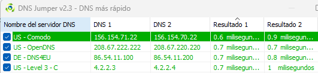
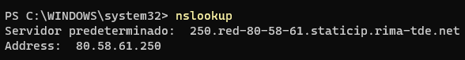
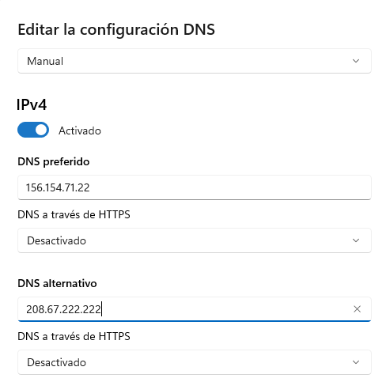
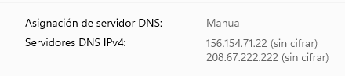
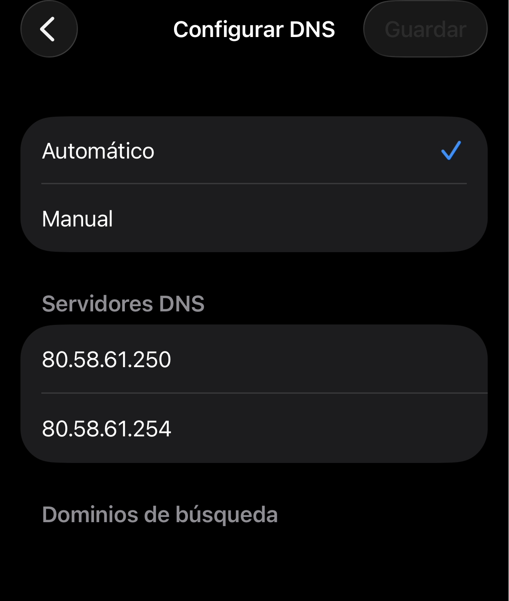
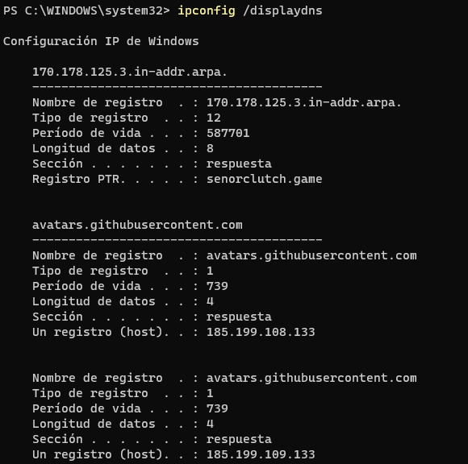
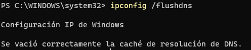

Joel Asensio Chavarria

# A1: Análisis y Resolución del Sistema DNS 

 
 
 
 
## El ecosistema DNS (OSINT y Web) [2p]
El sistema DNS es una estructura jerárquica a nivel mundial. Para administrar redes, primero debemos
entender quién gestiona cada parte del pastel.
 
### 1. Investigación de Jerarquía:
* <strong>¿Qué organismo internacional coordina y asigna los parámetros a nivel global del sistema de nombres de dominio e IPs?</strong>   
    * La Corporación de Internet para la Asignación de Nombres y Números (ICANN) es el organismo internacional que coordina y asigna los parámetros a nivel global del sistema de nombres de dominio y las direcciones IP.
* ¿Qué empresa u organismo gestiona (Registry) cada uno de los siguientes dominios de nivel
superior (TLD)?
 1. `.es` Esta gestionado por la organicacion **red.es**  
 2. `.cat` Esta gestionado por **Accent Obert** (antes era **Fundació puntCAT**)
 3. `.edu` Esta gestionado por **Educause**
 4. `.ifp.es` Esta gestionado por **Dominios.es o Red.es**, **Grupo Planeta** es el registrante pero no actua como organismo regulador

### 2. Herramientas OSINT (Whois y DNS Lookup):
* **Utiliza herramientas online (como Dominios.es, whois.com, nslookup.io) para responder a lo siguiente:**
    * ¿Qué información te brinda una consulta Whois sobre un dominio?
        * Una consulta Whois te muestra los datos de registro de un dominio, incluyendo las fechas clave, el proveedor y (si es público) la información de contacto del propietario
    * Define brevemente la diferencia entre el Registry de la base de datos y el Registrar (Registrador) del dominio.
        * El **Registry** (Registro) Es la organización central que gestiona y administra una extensión de dominio específica (como .com, .org o .es) mientras que **Registrar** (Registrador) es una empresa comercial autorizada a la que los usuarios finales acuden para comprar y contratar esos dominios.
    * Investiga: ¿Qué es **DNSSEC** y qué problema de seguridad intenta resolver en las resoluciones **DNS**?
        * **DNSSEC** (Domain Name System Security Extensions) es un conjunto de extensiones de seguridad añadidas al sistema DNS tradicional. Su objetivo principal es proteger Internet contra falsificaciones y garantizar que los usuarios lleguen al sitio web correcto.

### 3. Rendimiento DNS:
Ve a la web de **[GRC DNS Benchmark](https://www.grc.com/dns/benchmark.htm?utm_source=gemini)**
 
Descarga e inicia la aplicación (no requiere instalación).
 
Ejecuta el test para comprobar cuáles son los servidores DNS más rápidos desde tu ubicación.
 
Selecciona los 3 servidores más rápidos de la lista, anota sus IPs y argumenta brevemente de
qué empresas son. (Los utilizarás en la siguiente fase).
 
La aplicacion era de pago, he utilizado DNS Jumper
 

 
Las IP de los 3 servidores mas rapidos son:
 
**Comodo: 156.154.71.22**
 
**OpenDNS: 208.67.222.222**
 
**DNS4EU: 86.54.11.100**
 
 
**Informacion sobre empresas:**
 
**Comodo**: Comodo Group, Inc. es un grupo privado de empresas que provee de software y certificados digitales SSL fundada en 1998, con sede en Clifton, Nueva Jersey, Estados Unidos.
 
**OpenDNS**: OpenDNS es una empresa que ofrece el servicio de resolución de nombres de dominio (DNS) gratuito (para uso privado en el hogar) y abierto en su versión más básica y original.
 
**DNS4EU**: DNS4EU es una iniciativa de la Unión Europea que proporciona un servicio de resolución del sistema de nombres de dominio (DNS) seguro y que cumple con la normativa de privacidad.

## Configuración y Caché [2p]
Todo sistema operativo guarda las resoluciones DNS para no saturar la red.
 

### 1. Cambio de servidores DNS:
* <strong>¿Cómo puedes ver mediante consola (CLI) qué servidores DNS tienes asignados actualmente en Windows y en Linux?</strong>
    * En **Windows** he usado el comando `nslookup`. Al escribirlo sin nada más, te dice directamente el nombre y la IP del servidor DNS que tienes configurado en ese momento.                           
    
    * En **Linux** lo he mirado con `resolvectl status`, que te muestra los DNS que tiene asignados cada interfaz de red.

* **Cambia la configuración de red de tu equipo principal (Windows o Linux) poniendo como DNS primario y secundario los que obtuviste en el Benchmark de la Fase 1. Muestra captura del cambio.**
    * He puesto como DNS primario el de **Comodo**, la ip és **[156.154.71.22]** y secundario el de OpenDNS, ip **[208.67.222.222]** (los dos mas rapidos en el Benchmark)
    
    
     
    
    * Para comprobar que el cambio se había aplicado bien, he vuelto a ejecutar `nslookup` y ya me aparecía la nueva IP como servidor DNS.
    
     

* <strong>¿En qué menú de tu dispositivo móvil (Android/iOS) podrías forzar el uso de unos DNS específicos para tu conexión Wi-Fi?</strong>
    * Tengo un iPhone, así que lo he mirado en **iOS**: Ajustes → Wi-Fi → pulsando la "i" que sale al lado de la red a la que estoy conectado → Configuración DNS. Ahí puedes poner el modo manual e introducir los DNS que quieras.
     

        
     

### 2. Gestión de la caché DNS (ipconfig / resolvectl):
* **Utilizando tu terminal de Windows (ipconfig /displaydns) o Linux (resolvectl statistics o similar): Muestra una captura de pantalla de algunas direcciones almacenadas en la caché de tu equipo.**
    * En **Windows** he usado `ipconfig /displaydns`, que te saca un listado con todas las páginas que has visitado hace poco junto con su IP y el tiempo que le queda en la caché (TTL).
    
     
    * En **Linux** se puede ver algo parecido con `resolvectl statistics`, que muestra cuántas consultas se han resuelto usando la caché. 

* <strong>Vacía la caché de tu equipo (ipconfig /flushdns o resolvectl flush-caches). Explica para qué es útil esta acción en el día a día de un administrador de sistemas.</strong>
    * En **Windows** he ejecutado `ipconfig /flushdns`, que borra toda la caché DNS del equipo. 
    
 

    * En **Linux** el comando equivalente sería `resolvectl flush-caches`.
    * Esto es útil, por ejemplo, cuando una página web ha cambiado de servidor y sigue apareciendo la IP antigua, cuando se sospecha que la caché se ha "envenenado" con una dirección falsa (*DNS cache poisoning*), o simplemente para descartar que el problema de conexión venga de una entrada antigua guardada en el equipo.

## Webgrafia
### 1. Investigación de Jerarquía:
* **[¿Qué organismo internacional coordina y asigna los parámetros a nivel global del sistema de nombres de dominio e IPs?](https://es.wikipedia.org/wiki/Corporaci%C3%B3n_de_Internet_para_la_Asignaci%C3%B3n_de_Nombres_y_N%C3%BAmeros)**
* **¿Qué empresa u organismo gestiona (Registry) cada uno de los siguientes dominios de nivel
superior (TLD)?**
   * **[.es](https://helpdesk.cdmon.com/portal/es/kb/articles/informaci%C3%B3n-de-los-dominios-es)**
   * **[.cat](https://es.wikipedia.org/wiki/.cat)**
   * **[.edu](https://es.wikipedia.org/wiki/.edu)**

### 2. Herramientas OSINT (Whois y DNS Lookup):
* **[Diferencia Registry y Registrar](https://www.bluehost.com/es-es/blog/registro-de-dominios-vs-registrador-una-guia-completa-para-el-sistema-de-nombres-de-dominio/)**
* **[DNSSEC](https://learn.microsoft.com/es-es/windows-server/networking/dns/dnssec-overview)**

### 3. Rendimiento DNS
* **Informacion sobre empresas:**
  * **[Comodo](https://es.wikipedia.org/wiki/Comodo)**
  * **[OpenDNS](https://es.wikipedia.org/wiki/OpenDNS)**
  * **[DNS4EU](https://es.wikipedia.org/wiki/DNS4EU)**

### 4. Cambio de servidores DNS:
* **[Comando nslookup](https://raiolanetworks.com/blog/nslookup/)**
* **[resolvectl (man page)](https://man.archlinux.org/man/resolvectl.1.en)**
* **[Configurar DNS en iOS](https://www.xatakamovil.com/conectividad/que-dns-privado-todas-ventajas-configurarlo-tu-movil)**

### 5. Gestión de la caché DNS:
* **[ipconfig /displaydns y /flushdns](https://www.computerhope.com/ipconfig.htm)**
* **[resolvectl statistics y flush-caches](https://www.mankier.com/1/resolvectl)**

