Joel Asensio Chavarria

# A1: Análisis y Resolución del Sistema DNS 

<br>
<br>
<br>
<br>
## El ecosistema DNS (OSINT y Web) [2p]
El sistema DNS es una estructura jerárquica a nivel mundial. Para administrar redes, primero debemos
entender quién gestiona cada parte del pastel.
<br>
### 1. Investigación de Jerarquía:
* <strong>¿Qué organismo internacional coordina y asigna los parámetros a nivel global del sistema de nombres de dominio e IPs?</strong>   
    * La Corporación de Internet para la Asignación de Nombres y Números (ICANN) es el organismo internacional que coordina y asigna los parámetros a nivel global del sistema de nombres de dominio y las direcciones IP.
* ¿Qué empresa u organismo gestiona (Registry) cada uno de los siguientes dominios de nivel
superior (TLD)?
 1. `.es` Esta gestionado por la organicacion **red.es**  
 2. `.cat` Esta gestionado por **Accent Obert** (antes era **Fundació puntCAT**)
 3. `.edu` Esta gestionado por **Educause**
 4. `.ifp.es` Esta gestionado por **Dominios.es o Red.es**, **Grupo Planeta** es el registrante pero no actua como organismo regulador

### 2. Herramientas OSINT (Whois y DNS Lookup):
* **Utiliza herramientas online (como Dominios.es, whois.com, nslookup.io) para responder a lo siguiente:**
    * ¿Qué información te brinda una consulta Whois sobre un dominio?
        * Una consulta Whois te muestra los datos de registro de un dominio, incluyendo las fechas clave, el proveedor y (si es público) la información de contacto del propietario
    * Define brevemente la diferencia entre el Registry de la base de datos y el Registrar (Registrador) del dominio.
        * El **Registry** (Registro) Es la organización central que gestiona y administra una extensión de dominio específica (como .com, .org o .es) mientras que **Registrar** (Registrador) es una empresa comercial autorizada a la que los usuarios finales acuden para comprar y contratar esos dominios.
    * Investiga: ¿Qué es **DNSSEC** y qué problema de seguridad intenta resolver en las resoluciones **DNS**?
        * **DNSSEC** (Domain Name System Security Extensions) es un conjunto de extensiones de seguridad añadidas al sistema DNS tradicional. Su objetivo principal es proteger Internet contra falsificaciones y garantizar que los usuarios lleguen al sitio web correcto.

### 3. Rendimiento DNS:
Ve a la web de **[GRC DNS Benchmark](https://www.grc.com/dns/benchmark.htm?utm_source=gemini)**
<br>
Descarga e inicia la aplicación (no requiere instalación).
<br>
Ejecuta el test para comprobar cuáles son los servidores DNS más rápidos desde tu ubicación.
<br>
Selecciona los 3 servidores más rápidos de la lista, anota sus IPs y argumenta brevemente de
qué empresas son. (Los utilizarás en la siguiente fase).
<br>
La aplicacion era de pago, he utilizado DNS Jumper
<br>

<br>
Las IP de los 3 servidores mas rapidos son:
<br>
**Comodo: 156.154.71.22**
<br>
**OpenDNS: 208.67.222.222**
<br>
**DNS4EU: 86.54.11.100**
<br>
<br>
**Informacion sobre empresas:**
<br>
**Comodo**: Comodo Group, Inc. es un grupo privado de empresas que provee de software y certificados digitales SSL fundada en 1998, con sede en Clifton, Nueva Jersey, Estados Unidos.
<br>
**OpenDNS**: OpenDNS es una empresa que ofrece el servicio de resolución de nombres de dominio (DNS) gratuito (para uso privado en el hogar) y abierto en su versión más básica y original.
<br>
**DNS4EU**: DNS4EU es una iniciativa de la Unión Europea que proporciona un servicio de resolución del sistema de nombres de dominio (DNS) seguro y que cumple con la normativa de privacidad.

## Configuración y Caché [2p]
Todo sistema operativo guarda las resoluciones DNS para no saturar la red.
<br>

### 1. Cambio de servidores DNS:
* <strong>¿Cómo puedes ver mediante consola (CLI) qué servidores DNS tienes asignados actualmente en Windows y en Linux?</strong>
    * En **Windows** he usado el comando `nslookup`. Al escribirlo sin nada más, te dice directamente el nombre y la IP del servidor DNS que tienes configurado en ese momento. <br>                         
    
    * En **Linux** lo he mirado con `resolvectl status`, que te muestra los DNS que tiene asignados cada interfaz de red.

* **Cambia la configuración de red de tu equipo principal (Windows o Linux) poniendo como DNS primario y secundario los que obtuviste en el Benchmark de la Fase 1. Muestra captura del cambio.**
    * He puesto como DNS primario el de **Comodo**, la ip és **[156.154.71.22]** y secundario el de OpenDNS, ip **[208.67.222.222]** (los dos mas rapidos en el Benchmark)<br>
    <br>
    <br>
    
    * Para comprobar que el cambio se había aplicado bien, he vuelto a ejecutar `nslookup` y ya me aparecía la nueva IP como servidor DNS.
    
    <br>

* <strong>¿En qué menú de tu dispositivo móvil (Android/iOS) podrías forzar el uso de unos DNS específicos para tu conexión Wi-Fi?</strong>
    * Tengo un iPhone, así que lo he mirado en **iOS**: Ajustes → Wi-Fi → pulsando la "i" que sale al lado de la red a la que estoy conectado → Configuración DNS. Ahí puedes poner el modo manual e introducir los DNS que quieras.
     <p align="center">
        
     </p>

### 2. Gestión de la caché DNS (ipconfig / resolvectl):
* **Utilizando tu terminal de Windows (ipconfig /displaydns) o Linux (resolvectl statistics o similar): Muestra una captura de pantalla de algunas direcciones almacenadas en la caché de tu equipo.**
    * En **Windows** he usado `ipconfig /displaydns`, que te da un listado con todas las páginas que has visitado hace poco junto con su IP y el tiempo que le queda en la caché (TTL).<br><br>
    
    <br>
    * En **Linux** se puede ver algo parecido con `resolvectl statistics`, que muestra cuántas consultas se han resuelto usando la caché.<br>

* <strong>Vacía la caché de tu equipo (ipconfig /flushdns o resolvectl flush-caches). Explica para qué es útil esta acción en el día a día de un administrador de sistemas.</strong>
    * En **Windows** he ejecutado `ipconfig /flushdns`, que borra toda la caché DNS del equipo.<br><br>
    <br>


   * En **Linux** el comando equivalente sería `resolvectl flush-caches`.
```
Vaciar la caché DNS es útil porque me permite comprobar al momento si un cambio de IP o de registro ya se está resolviendo bien,
sin tener que esperar a que el TTL expire por sí solo.
También sirve para descartar que el problema sea una entrada antigua o "envenenada"
cuando estoy intentando diagnosticar un fallo de conexión.
Además es una acción rápida, segura y que no borra ni rompe nada en el sistema.
```
<br>

## Administración - Troubleshooting con DIG y CLI [3p]
En un entorno profesional, especialmente servidores Linux, la herramienta nslookup se considera obsoleta, siendo dig - Domain Information Groper - el estándar de la industria.

### 1. Consultas específicas de registros (dig en Linux/WSL):
He usado el dominio `aliexpress.com` para todas las pruebas.

* **A:** `dig aliexpress.com`
    * En la sección **ANSWER SECTION** aparece la IP (o IPs) a la que resuelve el dominio, junto con el tipo de registro (A) y el TTL.<br><br>
    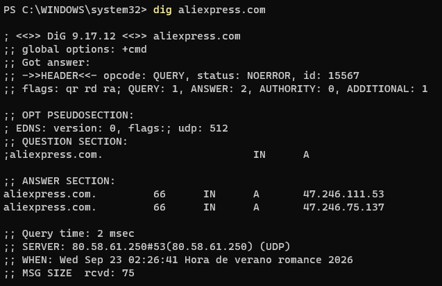

* **Short:** `dig +short aliexpress.com`
    * Este formato es útil en scripts de Bash porque solo devuelve la IP, sin todo el resto de información (cabecera, sección de pregunta, tiempos, etc...), así que se puede poner directamente en una variable o en un pipe sin tener que filtrar nada.<br><br>
    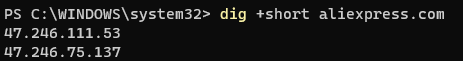

* **MX:** `dig MX aliexpress.com`
    * Aquí se ve el campo de **Preference** de cada servidor de correo, en este caso es 10 (sale al lado de mx2.mail.aliyun.com.). Cuanto más bajo es el número, más prioridad tiene ese servidor para recibir el correo primero.<br><br>
    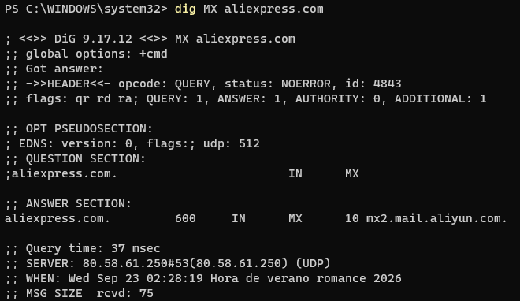

* **NS:** `dig NS aliexpress.com`
    * Muestra los servidores que tienen la autoridad sobre las zonas de ese dominio, es decir, los servidores DNS oficiales donde está delegada la gestión del dominio.<br><br>
    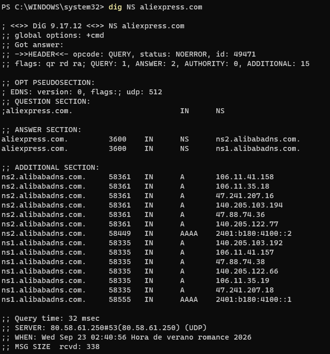

### 2. Autoridad y Caché (TTL):
* <strong>¿Qué diferencia existe entre un registro SOA (Start of Authority) y un registro NS (Name Server)?</strong>
    * El registro **SOA** solo hay uno por zona y contiene los datos administrativos de esa zona (servidor primario, email del administrador, número de serie, tiempos de refresco/reintento/caducidad...). El registro **NS**, en cambio, puede haber varios, y simplemente indica qué servidores son los responsables de resolver esa zona.

* **Realiza una consulta a un dominio cualquiera. Observa el valor TTL. Vuelve a realizar la consulta a los 5 segundos. ¿Qué ha pasado con el valor numérico del TTL? ¿Qué nos demuestra esto?**
    * He consultado el mismo dominio dos veces seguidas con unos segundos de diferencia y el valor del TTL ha bajado (aproximadamente los segundos que han pasado entre una consulta y otra).<br>
    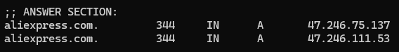<br><br>
    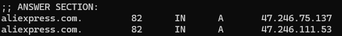<br>
    * Esto demuestra que la segunda respuesta no ha ido a preguntar al servidor autoritativo, sino que la ha servido directamente de la caché de mi resolver (por eso el TTL va bajando en vez de volver a su valor inicial). Si hubiera ido de nuevo al servidor autoritativo, el TTL habría vuelto a su valor máximo original.

### 3. Trazabilidad Completa (Trace):
* **Ejecuta el comando: dig +trace aliexpress.com** <br>
    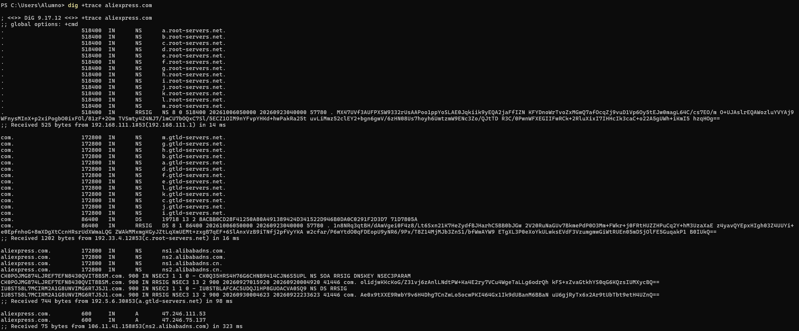
    * Al hacer `+trace`, mi ordenador no pregunta directamente al DNS de siempre, sino que hace el recorrido completo: primero contacta con los **Root Servers** (representados por el punto "."), que le indican quién gestiona el TLD `.com`. Después pregunta a esos servidores del TLD `.com`, que le dicen cuáles son los servidores autoritativos concretos del dominio `aliexpress.com`. Y por último pregunta directamente a esos servidores autoritativos, que son los que finalmente le dan la IP real del dominio.

## Análisis de Tráfico de Red (Wireshark) [3p]
Vamos a comprobar qué viaja realmente por el cable físico cuando resolvemos un nombre.

He abierto **Wireshark**, he empezado a capturar en mi tarjeta de red principal y he aplicado el filtro `dns` para quedarme solo con el tráfico DNS.<br>

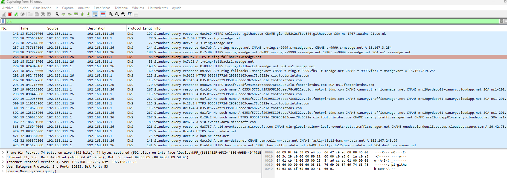

### 1. Capa de Transporte:
* <strong>¿Qué protocolo se utiliza (TCP o UDP)? ¿Por qué DNS utiliza este protocolo por defecto?</strong>
    * Se usa **UDP**. DNS lo usa por defecto porque es un protocolo sin conexión, mucho más rápido y ligero que TCP (no hay que montar la conexión antes de mandar los datos), lo cual es ideal para consultas cortas como estas. Solo se usa TCP cuando la respuesta es demasiado grande para un único paquete UDP o en transferencias de zona.

### 2. Puertos:
* <strong>Identifica el puerto de origen (dinámico) del cliente y el puerto de destino (conocido) del servidor.</strong><br>
    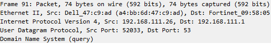
    * El puerto de origen es uno dinámico (asignado al azar por mi equipo) y el puerto de destino es el **53**, que es el puerto conocido y estándar para DNS.

### 3. Identificador:
* <strong>Expande la sección Domain Name System. ¿Qué identificador de transacción vincula la respuesta del servidor con la petición de tu cliente?</strong><br>
    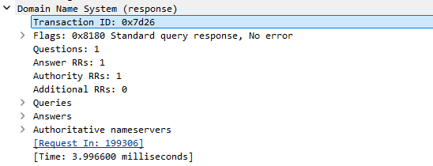<br>
    * El **Transaction ID** es un número que genera el cliente al hacer la petición, y el servidor devuelve ese mismo número en la respuesta. Así el cliente sabe que esa respuesta concreta corresponde a la pregunta que hizo (y no a otra consulta que esté en curso a la vez).

### 4. Flags:
* <strong>En el paquete de Respuesta, despliega la sección Flags. Busca la opción Authoritative Answer. ¿Está a 0 o a 1? ¿Qué significa esto?</strong>
    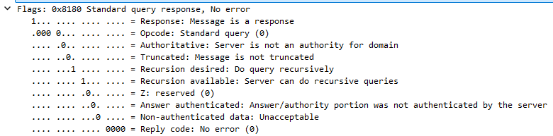<br>
    * En mi caso está a 0. Si está a 0 significa que la respuesta no viene directamente del servidor autoritativo del dominio, sino de un servidor intermedio (como el DNS de mi proveedor o el resolver que tenga configurado), que ya tenía la respuesta guardada en caché o la ha ido a buscar por mí.

### 5. Respuestas (Answers):
* <strong>¿Qué servidor de correo de Google tiene la prioridad (preference) más alta (el número más bajo)?</strong>
  <br>
    * El servidor con el número de preference más bajo que aparece es **smtp.google.com** con preference 10, que es el que tiene mayor prioridad para recibir el correo.<br>
## Webgrafia
### 1. Investigación de Jerarquía:
* **[¿Qué organismo internacional coordina y asigna los parámetros a nivel global del sistema de nombres de dominio e IPs?](https://es.wikipedia.org/wiki/Corporaci%C3%B3n_de_Internet_para_la_Asignaci%C3%B3n_de_Nombres_y_N%C3%BAmeros)**
* **¿Qué empresa u organismo gestiona (Registry) cada uno de los siguientes dominios de nivel superior (TLD)?**<br>
   * **[.es](https://helpdesk.cdmon.com/portal/es/kb/articles/informaci%C3%B3n-de-los-dominios-es)**
   * **[.cat](https://es.wikipedia.org/wiki/.cat)**
   * **[.edu](https://es.wikipedia.org/wiki/.edu)**

### 2. Herramientas OSINT (Whois y DNS Lookup):
* **[Diferencia Registry y Registrar](https://www.bluehost.com/es-es/blog/registro-de-dominios-vs-registrador-una-guia-completa-para-el-sistema-de-nombres-de-dominio/)**
* **[DNSSEC](https://learn.microsoft.com/es-es/windows-server/networking/dns/dnssec-overview)**

### 3. Rendimiento DNS
* **Informacion sobre empresas:**
  * **[Comodo](https://es.wikipedia.org/wiki/Comodo)**
  * **[OpenDNS](https://es.wikipedia.org/wiki/OpenDNS)**
  * **[DNS4EU](https://es.wikipedia.org/wiki/DNS4EU)**

### 4. Cambio de servidores DNS:
* **[Comando nslookup](https://raiolanetworks.com/blog/nslookup/)**
* **[resolvectl (man page)](https://man.archlinux.org/man/resolvectl.1.en)**
* **[Configurar DNS en iOS](https://www.xatakamovil.com/conectividad/que-dns-privado-todas-ventajas-configurarlo-tu-movil)**

### 5. Gestión de la caché DNS:
* **[ipconfig /displaydns y /flushdns](https://www.computerhope.com/ipconfig.htm)**
* **[resolvectl statistics y flush-caches](https://www.mankier.com/1/resolvectl)**


