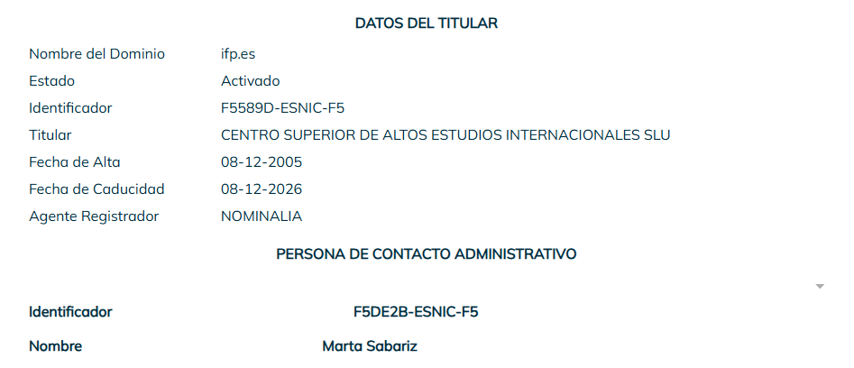

Joel Asensio Chavarria

# A1: Análisis y Resolución del Sistema DNS 

 
 
 
 
## El ecosistema DNS (OSINT y Web) [2p]
El sistema DNS es una estructura jerárquica a nivel mundial. Para administrar redes, primero debemos
entender quién gestiona cada parte del pastel.
 
### 1. Investigación de Jerarquía:
* <strong>¿Qué organismo internacional coordina y asigna los parámetros a nivel global del sistema de nombres de dominio e IPs?</strong>   
    * La Corporación de Internet para la Asignación de Nombres y Números (ICANN) es el organismo internacional que coordina y asigna los parámetros a nivel global del sistema de nombres de dominio y las direcciones IP.
* ¿Qué empresa u organismo gestiona (Registry) cada uno de los siguientes dominios de nivel
superior (TLD)?
 1. `.es` Esta gestionado por la organicacion **red.es**  
 2. `.cat` Esta gestionado por **Accent Obert** (antes era **Fundació puntCAT**)
 3. `.edu` Esta gestionado por **Educause**
 4. `.ifp.es` Esta gestionado por **Dominios.es o Red.es**, **Grupo Planeta** es el registrante pero no actua como organismo regulador

### 2. Herramientas OSINT (Whois y DNS Lookup):
* **Utiliza herramientas online (como Dominios.es, whois.com, nslookup.io) para responder a lo siguiente:**
    * ¿Qué información te brinda una consulta Whois sobre un dominio?
        * Una consulta Whois te muestra los datos de registro de un dominio, incluyendo las fechas clave, el proveedor y (si es público) la información de contacto del propietario
    * Define brevemente la diferencia entre el Registry de la base de datos y el Registrar (Registrador) del dominio.
        * El **Registry** (Registro) Es la organización central que gestiona y administra una extensión de dominio específica (como .com, .org o .es) mientras que **Registrar** (Registrador) es una empresa comercial autorizada a la que los usuarios finales acuden para comprar y contratar esos dominios.
    * Investiga: ¿Qué es **DNSSEC** y qué problema de seguridad intenta resolver en las resoluciones **DNS**?
        * **DNSSEC** (Domain Name System Security Extensions) es un conjunto de extensiones de seguridad añadidas al sistema DNS tradicional. Su objetivo principal es proteger Internet contra falsificaciones y garantizar que los usuarios lleguen al sitio web correcto.

### 3. Rendimiento DNS:
Ve a la web de **[GRC DNS Benchmark](https://www.grc.com/dns/benchmark.htm?utm_source=gemini)**
 
Descarga e inicia la aplicación (no requiere instalación).
 
Ejecuta el test para comprobar cuáles son los servidores DNS más rápidos desde tu ubicación.
 
Selecciona los 3 servidores más rápidos de la lista, anota sus IPs y argumenta brevemente de
qué empresas son. (Los utilizarás en la siguiente fase).
 
La aplicacion era de pago, he utilizado DNS Jumper
 

 
Las IP de los 3 servidores mas rapidos son:
 
**Comodo: 156.154.71.22**
 
**OpenDNS: 208.67.222.222**
 
**DNS4EU: 86.54.11.100**
 
**Informacion sobre empresas:**
 
**Comodo**: Comodo Group, Inc. es un grupo privado de empresas que provee de software y certificados digitales SSL fundada en 1998, con sede en Clifton, Nueva Jersey, Estados Unidos.
 
**OpenDNS**: OpenDNS es una empresa que ofrece el servicio de resolución de nombres de dominio (DNS) gratuito (para uso privado en el hogar) y abierto en su versión más básica y original.
 
**DNS4EU**: DNS4EU es una iniciativa de la Unión Europea que proporciona un servicio de resolución del sistema de nombres de dominio (DNS) seguro y que cumple con la normativa de privacidad.

## Webgrafia
### 1. Investigación de Jerarquía:
* **[¿Qué organismo internacional coordina y asigna los parámetros a nivel global del sistema de nombres de dominio e IPs?](https://es.wikipedia.org/wiki/Corporaci%C3%B3n_de_Internet_para_la_Asignaci%C3%B3n_de_Nombres_y_N%C3%BAmeros)**
* **¿Qué empresa u organismo gestiona (Registry) cada uno de los siguientes dominios de nivel
superior (TLD)?**
   * **[.es](https://helpdesk.cdmon.com/portal/es/kb/articles/informaci%C3%B3n-de-los-dominios-es)**
   * **[.cat](https://es.wikipedia.org/wiki/.cat)**
   * **[.edu](https://es.wikipedia.org/wiki/.edu)**
### 2. Herramientas OSINT (Whois y DNS Lookup):
* **Utiliza herramientas online (como Dominios.es, whois.com, nslookup.io) para responder a lo siguiente:**
    * ¿Qué información te brinda una consulta Whois sobre un dominio?
      
      Lo he hecho en dominios.es
       
       
       
   * Define brevemente la diferencia entre el Registry de la base de datos y el Registrar (Registrador) del dominio.
     * **[Diferencia Registry y Registrar](https://www.bluehost.com/es-es/blog/registro-de-dominios-vs-registrador-una-guia-completa-para-el-sistema-de-nombres-de-dominio/)**
   * Investiga: ¿Qué es **DNSSEC** y qué problema de seguridad intenta resolver en las resoluciones **DNS**?
     * **[DNSSEC](https://learn.microsoft.com/es-es/windows-server/networking/dns/dnssec-overview)**

### 3. Rendimiento DNS
* **Informacion sobre empresas:**
  * **[Comodo](https://es.wikipedia.org/wiki/Comodo)**
  * **[OpenDNS](https://es.wikipedia.org/wiki/OpenDNS)**
  * **[DNS4EU](https://es.wikipedia.org/wiki/DNS4EU)**

